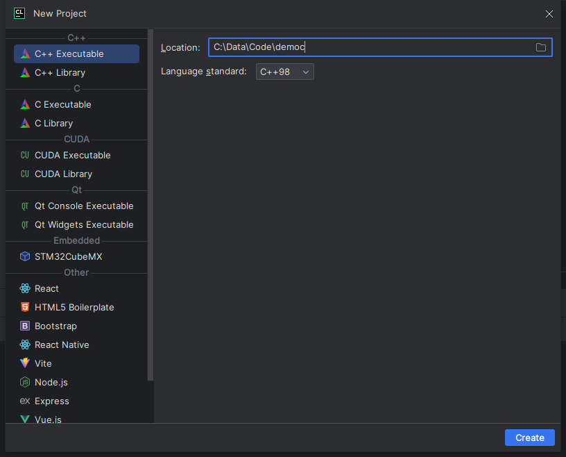

## IDE

目前对于`c/c++`的`IDE`选择还是很丰富的，以下只是我用过或了解的

- `vs(visual studio)`
- `CLion`

我目前在用的是 `CLion`，大学时期用过 `vs`，使用时间太短，就不给大家推荐了哈.

## 环境搭建

vs在下载时就会默认让下载编译环境，所以无需过多配置，但是下载很慢。

`Clion`需要自行配置，但是也可以让系统自己去下载，对于这一块我其实了解的很少，暂时不做深入了解，精力有限。

## New Project

选择 `c++98` 版本.

