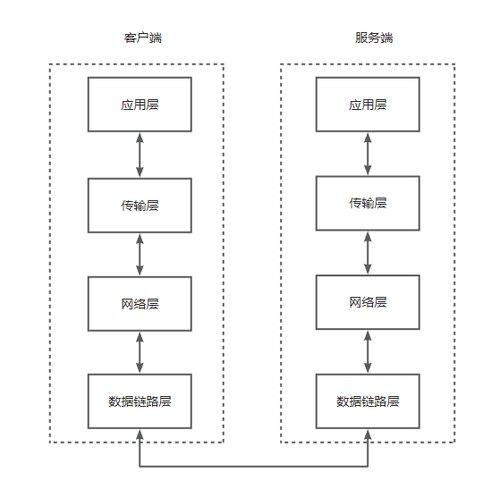

我们经常会在浏览器里输入`www.baidu.com`，然后就会看到一个百度的搜索页面，那么这个过程是如何完成的呢？

简单来说就是：你向百度的服务器发起一个请求，百度的服务器给你一个响应，这个响应的内容就是你看到的页面。

在这个过程中，你（实际上是你的电脑）扮演的就是**客户端**。

在早期，网站使用的都是 `HTTP` 协议，但是出于安全性考虑， `HTTP` 逐渐被 `HTTPS` 代替，而协议指的就是规则的约定，你可以认为他是一种标准。

假设，你有一个房子（模拟客户端），然后，你要获取一系列资源（网络），保证自己可以生存下去，并解决自己的一系列需求。

## `HTTP` 的诞生

[参考Wikipedia](https://en.wikipedia.org/wiki/HTTP#History)

受  `Vannevar Bush` 在1945年的一篇论文中描述的一个1930年版本的 `the microfilm-based information retrieval and management "memex"` 系统的启发， `Tim Berners-Lee` 和他的团队 `CERN` (被认为)发明了初版  `HTTP`、`HTML` 以及其他相关技术。

`Berners-Lee` 设计 `HTTP` 是为了帮助他采用他的另外一个想法: `the "WorldWideWeb" project`, 首次提出于 1989, 也就是现在被熟知的 `World Wide Web`.

世界上第一个网络服务上线于 1990，当时的协议只有 `GET` 方法，用于请求服务器上的页面，而且服务器的响应一直都是 `HTML` 页面。

## `TCP/IP` 协议族

### `TCP/IP` 分层

`TCP/IP`协议族里最重要的一点就是分层。`TCP/IP`协议族按层次分别分为：应用层、传输层、网络层、数据链路层。

分层的好处不言而喻

- 降低个层次之间的耦合性
- 每一层在规范内，可以有不同的实现
- 每一层的更新不会影响其他层
- 设计变得简单，专注实现自己的功能即可

### 应用层

应用层决定了传输的核心内容是什么，比如，你向服务器发送 "Hello world!"，那么应用层的作用就是将 "Hello world!" 包装起来，传给传输层。

应用层的协议有 `HTTP`、`FTP`、`DNS`。

现在，你需要水、燃气，你需要向水站、燃气公司发请求，请求的资源当然就是水和燃气啦，此时，燃气和水就是服务器向你发送的内容。

#### `DNS`

Domain Name System，应用层协议。

作用是将**域名**转换成 `IP地址`。

为什么需要DNS协议呢？

首先，我们知道服务器有 `IP地址`、主机名、域名，而人倾向于记忆主机名和域名，计算机倾向于处理 `IP地址`。

假如，我为了访问方便，我会直接输入 `www.baidu.com` 来访问服务，然而为了计算机处理方便，我们会将域名转成 `IP地址` 交给计算机，这个将域名转成 `IP地址` 的过程就是 `DNS` 提供的服务

### 传输层

传输层决定了目的地的端口，我们都知道，一个服务器是有很多端口的，如果不指定端口，则会默认发给 80 端口，如果服务器的端口不是80，那么你就需要指定端口号，如 8080，然后在传输层加上端口信息。

你打开水龙头能获取水，打开燃气阀能获取燃气，水龙头和燃气阀就是传输层的作用，当然他们同样要保证水和燃气能输送给你。

#### `TCP`

Transmission Control Protocol，传输控制协议

位于传输层，可靠的传输协议，提供可靠的字节流服务，三次握手。

字节流服务（Byte Stream Service）是指，为了方便传输，将大块数据分割成以报文段（segment）为单位的数据包进行传输。

#### `UDP`

User Data Protocol，用户数据协议

### 网络层

网络层用来处理网络上的数据包。数据包是网络上传输的最小数据单位，

两点之间，直线最短，但是如果有多个点，如何找到一条合适的路径，就是网络层要做的事。

#### `IP`

Internet Protocol，网际协议。位于网络层。

`TCP/IP` 中的 `IP` 指的是 `IP协议`，要与 `IP地址` 区分开。

通过 `IP协议` 可以将数据包发送给对方，这个过程中需要满足很多条件，其中最重要的两条就是

- `IP地址`，指明了节点被分配的地址
- [`MAC地址`](https://en.wikipedia.org/wiki/MAC_address)，是网络设备的物理地址，通常被烧录在 `NIC（Network Interface Controller，网卡）` 上，是由 `IEEE（国际电子协会）` 分配的全球唯一地址，`MAC地址` 共48位（即6字节），以16进制表示

#### `DNS`

#### `ARP`

使用 `ARP协议` 凭借 `MAC地址` 进行通信，根据 `IP地址` 反查 `MAC地址`.

### 数据链路层

用来处理连接网络中的硬件。

如网线、光纤、网卡、驱动（打印机驱动，鼠标驱动等）等硬件。

### Data flow

[原图](https://www.yuque.com/u21559410/xqh5kz/pt173506chpwo7fu/edit?toc_node_uuid=Qp95NdAMxvVhk84e)

## `URI` 与 `URL`

[RFC 2396](https://www.rfc-editor.org/rfc/pdfrfc/rfc2396.txt.pdf)

### `URI`

Uniform Resource Identifier，统一资源标识符，

### `URL`

Uniform Resource Locator，统一资源定位符，简单理解就是资源的网络地址

## 三次握手

Three-way Handshaking，传输层，`TCP协议` 为了保证消息的可靠性，采用了三次握手的策略。

用 `TCP协议` 将数据包发送出去后，TCP 不会对其置之不理，而是一定会向对方确认是否发送成功。握手过程中使用了 TCP 的标志，

- SYN（synchronize）
- ACK（acknowledge）

### 过程

1、发送端发送一个带 `SYN 标志`的数据包给对方，表示我要开始建立连接（同步）了

2、接收方收到后，会发送一个带`新的 SYN 标志` 以及 `ACK = 发送方 SYN + 1` 的数据包给发送方，表示我收到你的请求了，并确认开始建立连接

3、发送方再发送一个`ACK = 接收方 SYN + 1` 的数据包给接收方，表示链接已经建立，握手结束。

### 演示
